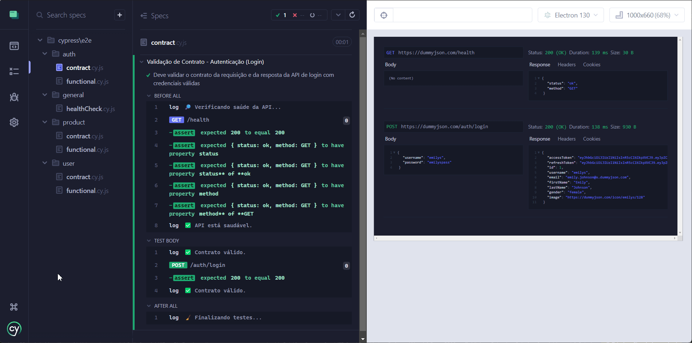
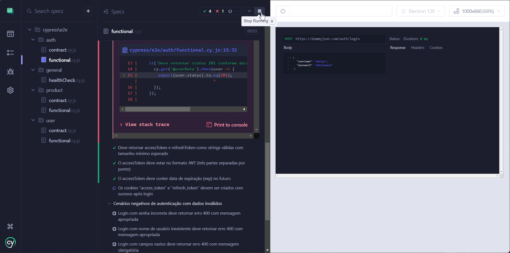

# 🔍 Projeto: Testes Automatizados de API com Cypress e Mochawesome

Este repositório contém a automação de testes para a API pública [DummyJSON](https://dummyjson.com/), utilizando **Cypress** para validações funcionais e de contrato, com geração de relatórios via **Mochawesome**.

---

## 🧪 Tipos de Testes Automatizados

Os testes estão organizados por contexto de negócio e cobrem:

- ✅ Testes **Funcionais**: Validação do comportamento da API em diversos fluxos (GET, POST, limites, tokens).
- 🔐 Testes de **Contrato**: Validação do schema JSON das respostas com **AJV**.
- 🏥 Teste de **Saúde (Health Check)**: Garante que a API está ativa antes da execução da suíte.
- 🔁 Testes com **valores de borda**, dados dinâmicos e autenticação via tokens JWT.

---

## 📸 Demo dos Testes 


Abaixo, uma demonstração visual da execução dos testes funcionais e de contrato usando o modo interativo do Cypress (Cypress Open):

<h1 align="center">
  
</h1>

<h1 align="center">
  
</h1>


## 📁 Estrutura do Projeto

```
cypress/
├── e2e/
│   ├── auth/         # Testes de autenticação
│   ├── product/      # Testes de produtos
│   ├── user/         # Testes de usuários
│   └── general/      # Health check
├── fixtures/         # Dados simulados (mocks)
├── support/
│   ├── commands.js   # Comandos customizados Cypress
│   └── utils/        # Utilitários AJV, factories, mensagens
│   └── schemas/      # Schemas JSON para validação de contrato
```

---

## 🚀 Tecnologias Utilizadas

- [Cypress](https://www.cypress.io/) — Testes de API com suporte a interceptações e validações ricas.
- [AJV](https://ajv.js.org/) — Validação de contrato com JSON Schema.
- [Mochawesome](https://github.com/adamgruber/mochawesome) — Geração de relatórios HTML detalhados.
- [Cypress plugin API](https://www.npmjs.com/package/cypress-plugin-api) — Plugin que adiciona informações nos testes interface detalhados.
- [Faker.js](https://fakerjs.dev/) — Geração de dados dinâmicos.
- [ESLint](https://eslint.org/) — Padronização e qualidade de código.

---

## 🧩 Plano e Estratégia de Testes

### 🔍 Estratégia Geral

- 🔁 Divisão clara por módulo (`auth`, `product`, `user`)
- 🧪 Testes funcionais e de contrato para todos os endpoints relevantes
- ⚠️ Inclusão de testes negativos, limites e tokens inválidos/expirados
- 🔎 Validações contra fixtures (mocks) conhecidos para maior robustez

### 📊 Cobertura Atual

| Categoria      | Tipos de Teste        | Exemplo de Cobertura                                      |
|----------------|-----------------------|------------------------------------------------------------|
| Auth           | Funcional + Contrato  | Login, validade de JWT, cookies, erros de autenticação     |
| Usuários       | Funcional + Contrato  | Listagem, busca por ID, contratos com fixture              |
| Produtos       | Funcional + Contrato  | Cadastro, leitura, limites, contratos                      |
| Health Check   | Pré-execução          | Verificação do endpoint `/health` antes da suíte iniciar   |

---

## ⚠️ Divergências entre Documentação e Comportamento Real da API

| Endpoint | Problema Identificado |
|---------|------------------------|
| `/users/{id}` | Documentação não detalha corretamente os valores reais do campos `image` (URL) |
| `/users` | Campos e valores reais diferentes da documentação |
| `/auth/login` | Retorno com status 200 (documentação menciona 201) | 
| `/auth/login`    | Documentação menciona o campo `paginação`, mas não é retornado na resposta |

---

## 🐞 Bugs Funcionais Encontrados Durante os Testes

| ID | Descrição do Bug | Impacto |
|----|-------------------|---------|
| 001 | API permite cadastrar produtos com todos os campos vazios | Dados inválidos são aceitos |


## 🧪 Como Executar os Testes

### 1️⃣ Instalar dependências:

```bash
npm install
```

### 2️⃣ Configure variáveis de ambiente:
Crie um arquivo chamado cypress.env.json na raiz do projeto com base no exemplo abaixo:

```json
{
  "AUTH_USERNAME": "",
  "AUTH_PASSWORD": "",
  "BASE_API_URL": "https://dummyjson.com",
    "requestMode": true
}
```

### 3️⃣ Rodar testes via interface visual do Cypress:

```bash
npm run test:open
```

---

## 📊 Relatórios de Testes

### ✅ Gerar Relatório Mochawesome:

```bash
npm run test
npm run test:merge
npm run test:generate
```

Esses comandos:
1. Executa todos os testes (`cypress run`)
2. Consolida os arquivos `.json` com `mochawesome-merge`
3. Gera um relatório em HTML com `mochawesome-report-generator`

📁 Relatório final:  
`mochawesome-report/cypress/reports/html/output.html`

---

## 🛠 Scripts úteis (`package.json`)

```json
"scripts": {
  "test": "cypress run",
  "test:open": "cypress open",
  "report:merge": "npx mochawesome-merge -f cypress/reports/*.json --output cypress/reports/output.json",
  "report:generate": "npx mochawesome-report-generator cypress/reports/output.json --output cypress/reports/html --inline",
  "test:report": "npm run test && npm run report:merge && npm run report:generate"
}
```
## ⚙️ Integração Contínua (CI) com GitHub Actions

O projeto está integrado ao **GitHub Actions** com uma pipeline de build automatizada que executa todos os testes Cypress em **pull requests** e **commits na branch `test`**.

📁 Arquivo de configuração:  
`.github/workflows/cypress-tests.yml`

### O que a pipeline faz?

- Instala o Node.js na versão `20.5.1`
- Instala dependências do projeto via `npm ci`
- Executa todos os testes automatizados com Cypress
- Garante que o build falhe caso haja testes com falha

```yaml
on:
  push:
    branches: [test]
  pull_request:
    branches: [test]
```

---

